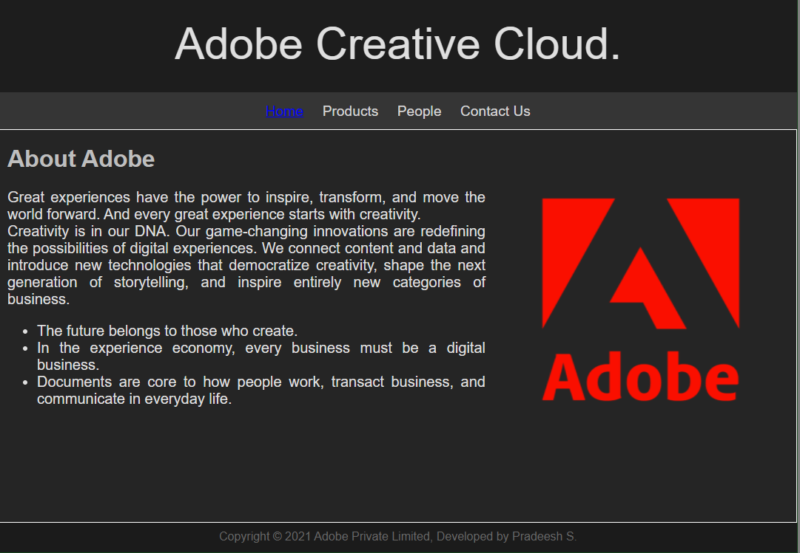
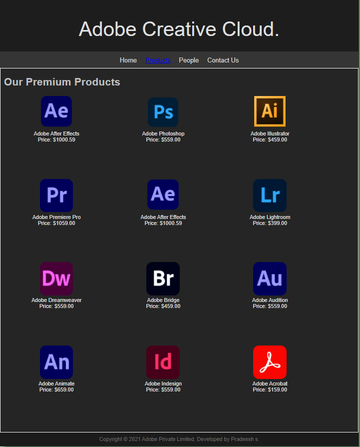
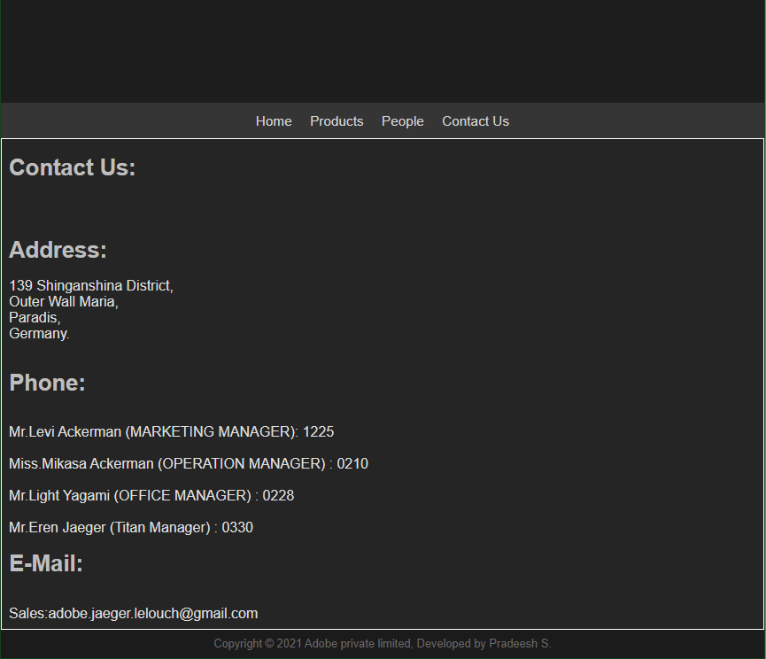
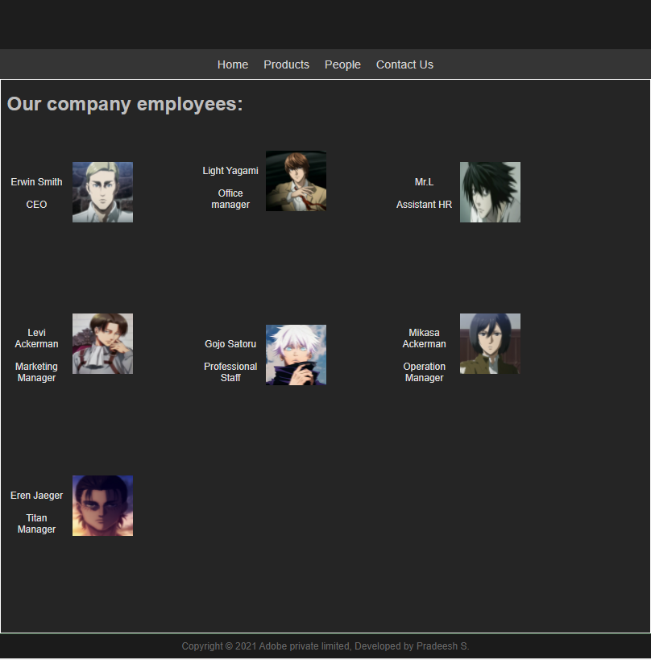

# Web Design for a Software Product Company

## AIM:

To design a static website for a software product company company.

## DESIGN STEPS:

### Step 1:

Requirement collection.

### Step 2:

Creating the layout using HTML and CSS.

### Step 3:

Updating the sample content.

### Step 4:

Choose the appropriate style and color scheme.

### Step 5:

Validate the layout in various browsers.

### Step 6:

Validate the HTML code.

### Step 6:

Publish the website in the given URL.

## PROGRAM :
```
<!DOCTYPE html>
<html lang="en">
  <head>
    <title>Adobe</title>
    <link rel="stylesheet" href="./css/layout.css" />
    <link rel="icon" href="./img/icon.png" type="image/x-icon" />
  </head>

  <body>
    <div class="container">
      <div class="banner">Adobe Creative Cloud.</div>
      <div class="menu">
        <div class="menuitemselected"><a href="/static/home.html">Home</a></div>
        <div class="menuitem"><a href="/static/products.html">Products</a></div>
        <div class="menuitem"><a href="/static/people.html">People</a></div>
        <div class="menuitem"><a href="/static/contacts.html">Contact Us</a></div>
      </div>
      <div class="content">
        <div class="homecontent">
          <h1>About Adobe</h1>
          
          <div class="contenttext">
            Great experiences have the power to inspire, transform, and move the world forward. And every great experience starts with creativity.
            <br />
            Creativity is in our DNA. Our game-changing innovations are redefining the possibilities of digital experiences. 
            We connect content and data and introduce new technologies that democratize creativity, 
            shape the next generation of storytelling, and inspire entirely new categories of business.
            <ul>
              <li>The future belongs to those who create.</li>
              <li>In the experience economy, every business must be a digital business.</li>
              <li>Documents are core to how people work, transact business, and communicate in everyday life.</li>
            </ul>
          </div>
        </div>
      </div>
      <div class="footer">
        Copyright &#169; 2021 Adobe Private Limited, Developed by Pradeesh S.
      </div>
    </div>
  </body>
</html>
```

```
<!DOCTYPE html>
<html lang="en">
  <head>
    <title>EduSoft Private Limited</title>
    <link rel="stylesheet" href="./css/layout.css" />
    <link rel="icon" href="./img/icon.png" type="image/x-icon" />
  </head>

  <body>
    <div class="container">
      <div class="banner">Adobe Creative Cloud.</div>
      <div class="menu">
        <div class="menuitem"><a href="/static/home.html">Home</a></div>
        <div class="menuitemselected">
          <a href="/static/products.html">Products</a>
        </div>
        <div class="menuitem"><a>People</a></div>
        <div class="menuitem"><a>Contact Us</a></div>
      </div>
      <div class="content">
        <div class="productcontent">    
          <h1>Our Premium Products</h1>
          <div class="productitems">
              <div class="productitem"> 
                  <div class="itemimage">
                  
                  </div>
                  <div class="itemname">Adobe After Effects</div>
                  <div class="itemprice">Price: $1000.59 </div>
              </div>
              <div class="productitem"> 
                  <div class="itemimage">
                  
                  </div>
                  <div class="itemname">Adobe Photoshop</div>
                  <div class="itemprice">Price: $559.00 </div>
              </div>
              <div class="productitem"> 
                  <div class="itemimage">
                  
                  </div>
                  <div class="itemname">Adobe Illustrator</div>
                  <div class="itemprice">Price: $459.00 </div>
              </div>
              <div class="productitem"> 
                <div class="itemimage">
                
                </div>
                <div class="itemname">Adobe Premiere Pro</div>
                <div class="itemprice">Price: $1059.00 </div>
              </div>
              <div class="productitem"> 
                <div class="itemimage">
                
                </div>
                <div class="itemname">Adobe After Effects</div>
                <div class="itemprice">Price: $1000.59 </div>
            </div>
            <div class="productitem"> 
                <div class="itemimage">
                
                </div>
                <div class="itemname">Adobe Lightroom</div>
                <div class="itemprice">Price: $399.00 </div>
            </div>
            <div class="productitem"> 
                <div class="itemimage">
                
                </div>
                <div class="itemname">Adobe Dreamweaver</div>
                <div class="itemprice">Price: $559.00 </div>
            </div>
            <div class="productitem"> 
              <div class="itemimage">
              
              </div>
              <div class="itemname">Adobe Bridge</div>
              <div class="itemprice">Price: $459.00 </div>
            </div>
            <div class="productitem"> 
              <div class="itemimage">
              
              </div>
              <div class="itemname">Adobe Audition</div>
              <div class="itemprice">Price: $559.00 </div>
          </div>
          <div class="productitem"> 
              <div class="itemimage">
              
              </div>
              <div class="itemname">Adobe Animate</div>
              <div class="itemprice">Price: $659.00 </div>
          </div>
          <div class="productitem"> 
            <div class="itemimage">
            
            </div>
            <div class="itemname">Adobe Indesign</div>
            <div class="itemprice">Price: $559.00 </div>
          </div>
          <div class="productitem"> 
            <div class="itemimage">
            
            </div>
            <div class="itemname">Adobe Acrobat</div>
            <div class="itemprice">Price: $159.00 </div>
          </div>

          </div>
          </div>        
      </div>
      <div class="footer">
        Copyright &#169; 2021 Adobe Private Limited, Developed by Pradeesh s.
      </div>
    </div>
  </body>
</html>

```

```
<!DOCTYPE html>
<html lang="en">
  <head>
    <title>Adobe</title>
    <link rel="stylesheet" href="./css/layout.css" />
    <link rel="icon" href="./img/icon.png" type="image/x-icon" />
  </head>

  <body>
    <div class="container">
      <div class="banner"></div>
      <div class="menu">
        <div class="menuitem"><a href="/static/home.html">Home</a></div>
        <div class="menuitem"><a href="/static/products.html">Products</a></div>
        <div class="menuitem"><a href="/static/people.html">People</a></div>
        <div class="menuitem"><a href="/static/contacts.html">Contact Us</a></div>
      </div>
      <div class="content">
        <div class="homecontent">
          <h1>Contact Us:</h1><br><br>
          <h1>Address:</h1>
          <div class="contenttext">
           139 Shinganshina District,<br>
           Outer Wall Maria,<br>
           Paradis,<br>
           Germany.<br>
          </div><br>
          <h1>Phone:</h1><br>
          <div class="contenttext">
              Mr.Levi Ackerman (MARKETING MANAGER): 1225<br><br>
              Miss.Mikasa Ackerman (OPERATION MANAGER) : 0210<br><br>
              Mr.Light Yagami (OFFICE MANAGER) : 0228<br><br>
              Mr.Eren Jaeger (Titan Manager) : 0330
          </div>
          <h1>E-Mail:</h1><br>
          <div class="contenttext">
              Sales:adobe.jaeger.lelouch@gmail.com
          </div>
        </div>
      </div>
      <div class="footer">
        Copyright &#169; 2021 Adobe private limited, Developed by Pradeesh S.
      </div>
    </div>
  </body>
</html>
```

```
<!DOCTYPE html>
<html lang="en">
  <head>
    <title>Adobe</title>
    <link rel="stylesheet" href="./css/layout.css" />
    <link rel="icon" href="./img/icon.png" type="image/x-icon" />
    </head>
    <body>
    <div class="container">
      <div class="banner"></div>
      <div class="menu">
        <div class="menuitem"><a href="/static/home.html">Home</a></div>
        <div class="menuitem"><a href="/static/products.html">Products</a></div>
        <div class="menuitem"><a href="/static/people.html">People</a></div>
        <div class="menuitem"><a href="/static/contactus.html">Contact Us</a></div>
        </div>
      <div class="content">
        <div class="homecontent">
          <h1>Our company employees:</h1><br><br>
          <div class="productitems">
            <div class="productitem"> 
                <div class="itemimage">
                
                </div>
                <br>
                <div class="itemname">Erwin Smith</div><br>
                <div class="itemprice">CEO</div>
            </div>
            <div class="productitem"> 
                <div class="itemimage">
                
                </div>
                <br>
                <div class="itemname">Light Yagami</div><br>
                <div class="itemprice">Office manager</div>
            </div>
            <div class="productitem"> 
              <div class="itemimage">
              
              </div><br>
              <div class="itemname">Mr.L</div><br>
              <div class="itemprice">Assistant HR</div>
            </div>
            <div class="productitem"> 
              <div class="itemimage">
              
              </div><br>
              <div class="itemname">Levi Ackerman</div><br>
              <div class="itemprice">Marketing Manager</div>
          </div>
          <div class="productitem"> 
            <div class="itemimage">
            
            </div><br>
            <div class="itemname">Gojo Satoru</div><br>
            <div class="itemprice">Professional Staff</div>
        </div>  <div class="productitem"> 
          <div class="itemimage">
          
          </div><br>
          <div class="itemname">Mikasa Ackerman</div><br>
          <div class="itemprice">Operation Manager</div>
      </div>
      <div class="productitem"> 
        <div class="itemimage">
        
        </div><br>
        <div class="itemname">Eren Jaeger</div><br>
        <div class="itemprice">Titan Manager</div>
    </div>
          </div>
        </div>
        </div>        
    </div>
    <div class="footer">
      Copyright &#169; 2021 Adobe private limited, Developed by Pradeesh S.
  </div>
</body>
</html>
```

```
* {
  box-sizing: border-box;
  font-family: Arial, Helvetica, sans-serif;
}
body {
  background-color: whitesmoke;
  color: #17421d;
}
.container {
  width: 1080px;
  margin-left: auto;
  margin-right: auto;
  border-width: 1px 1px 1px 1px;
  border-style: solid;
  box-shadow: 15px 15px 8px gray;
}

.banner {
  display: block;
  width: 100%;
  height: 250px;
  text-align: center;
  font-size: 60px;
  background-color: #1d1d1d;
  background-size: 100% 100%;
  margin: 0px 0px 0px 0px;
  padding-top: 150px;
  color: #dfdfdf;
}
h1{
  color: #bebebe;
}
.menu {
  display: block;
  width: 100%;
  height: 50px;
  font-size: larger;
  background-color: #353535;
  text-align: center;
  padding-top: 15px;
  margin: 0px 0px 0px 0px;
  border-width: 1px;
}

.menuitem {
  display: inline-block;
  margin-left: 10px;
  margin-right: 10px;
}
.menuitemselected {
  display: inline-block;
  margin-left: 10px;
  margin-right: 10px;
  color: #16d1ae;
}

.menuitem a {
  text-decoration: none;
  color: #d6d6d6;
}

.content {
  display: block;
  width: 100%;
  background-color: #252525;
  min-height: 500px;
  margin: 0px 0px 0px 0px;
  border-width: 1px;
  border-color: white;
  border-style: solid;
}
.homecontent {
  min-height: 500px;
  margin: 10px 10px 10px 10px;
}
.homecontent h1 {
  text-align: left;
}
.homecontent img {
  float: right;
  width: 400px;
  height: 300px;
  margin-left: 10px;
}

.contenttext {
  text-align: justify;
  color:#dfdfdf;
  font-size: 20px;
}

.productcontent {
  min-height: 500px;
  margin: 10px 10px 10px 10px;
}

.productcontent h1 {
  text-align: left;
}

.productitems {
  display: block;
}

.productitem {
  display: inline-block;
  width: 30%;
  height: 250px;
  text-align: center;
}

.productitem img {
  width: 100px;
  height: 100px;
  display: block;
}
.productitem .itemimage {
  display: block;
  margin-left: auto;
  margin-right: auto;
  width: 100px;
  margin-bottom: 5px;
}

.productitem .itemname {
  display: block;
  color: #dfdfdf;
}
.productitem .itemprice {
  display: block;
  color: #dfdfdf;
}

.footer {
  display: block;
  width: 100%;
  height: 40px;
  background-color: #1b1b1b;
  text-align: center;
  padding-top: 10px;
  margin: 0px 0px 0px 0px;
  color: #686868;
}

```
## OUTPUT:

### Home Page:

### Products Page:

### Contact Us Page:

### People Page:


## Result:

Thus a website is designed for the software product company and the HTML,CSS code are validated.
